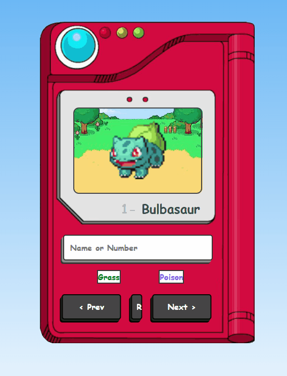

# 🧢 Pokédex Interativa

> Aplicação web que consome a PokéAPI para exibir informações de Pokémon em tempo real, com foco em interatividade, experiência do usuário e manipulação de estado no front-end.

---

## 🚀 Preview

- 📌 Busca por nome ou número
- 📌 Navegação sequencial entre Pokémon
- 📌 Exibição de imagem animada (Gen V)
- 📌 Tipagem com cores dinâmicas
- 📌 Interação avançada com botão multifunção



---

## 💡 Contexto do projeto

Este projeto foi desenvolvido com o objetivo de praticar consumo de API e manipulação dinâmica de dados no front-end.

Durante o desenvolvimento, evoluiu de uma aplicação simples de consulta para uma interface mais interativa, incorporando melhorias de usabilidade baseadas em comportamento real de uso.

Um dos destaques do projeto é a implementação de múltiplas ações em um único botão, diferenciando clique e pressionamento contínuo para executar funcionalidades distintas.

---

## 🛠️ Tecnologias utilizadas


---

## 📚 Conceitos aplicados

* Consumo de API com `fetch`
* Manipulação de DOM
* Controle de estado com JavaScript
* Tratamento de dados assíncronos
* Renderização dinâmica de conteúdo
* Mapeamento de dados para UI (tipos → cores)
* Eventos avançados (`mousedown`, `mouseup`, `click`)

---

## ⚙️ Funcionalidades

* 🔎 Busca de Pokémon por nome ou número
* ⬅️➡️ Navegação entre Pokémon (anterior/próximo)
* 🎲 Seleção aleatória de Pokémon
* 🎯 Exibição de tipos com cores personalizadas
* 📱 Interface responsiva

---

## 🧠 Destaque técnico

### Botão multifunção (interação avançada)

O botão **"R"** possui dois comportamentos distintos com base na interação do usuário:

* **Clique rápido:** seleciona um Pokémon aleatório
* **Pressionamento contínuo:** retorna ao Pokémon inicial (#1)

Essa funcionalidade foi implementada através do controle de tempo de pressionamento, evitando conflitos entre eventos como `click` e `mousedown`.

---

## ▶️ Como executar o projeto

```bash
# Clone o repositório
git clone https://github.com/seu-usuario/seu-repositorio.git

# Acesse a pasta
cd seu-repositorio

# Abra o arquivo
index.html
```

---

## 👨‍💻 Autor

Feito por **Vitor dos Reis**

